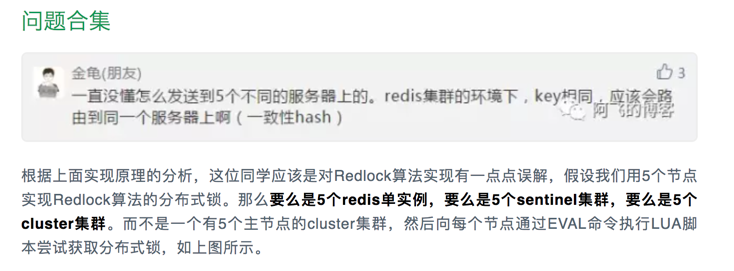

# redlock-hyperf

```
composer require zonghay/redlock-hyperf
```
Based on [redlock-php](https://github.com/ronnylt/redlock-php) transform to [Hyperf  2.1.*](https://github.com/hyperf/hyperf) 

本sdk基于redlock-php向hyperf ～2.1版本改造。

使用前建议先了解一下Redlock算法的原理，[Redis作者Antirez文章解释Redlock算法（英文）](http://antirez.com/news/77)

中文翻译bing一下就好了

### 使用

#### 简单使用
```php
    try {
        $lock = $this->container->get(RedLock::class)->setRedisPoolName()->setRetryCount(1)->lock('redlock-hyperf-test', 60000);
        if ($lock) {
            //do your code
            $this->container->get(RedLock::class)->unlock($lock);
        }
    } catch (\Throwable $throwable) {
        var_dump($throwable->getMessage());
    }
```
* setRedisPoolName方法用于指定Redlock使用哪些Redis实例作为分布式独立节点，这里需要传入索引数组，默认['default']，数组的值应该是/config/autoload/redis下的连接池name
  关于为什么要使用独立的Redis节点：
  
  
* setRetryCount方法用于设置获取锁的重试次数，默认2次
* setRetryDelay 用于一次获取锁失败后延迟时间后重试，默认200，单位毫秒
* lock方法，获取锁
  * resource：锁的key
  * ttl：锁过期时间，单位毫秒。
  * return：array|false
* unlock方法，释放锁
  * 参数：lock方法成功后的return
* 如果担心请求保持锁阶段进程出现重启或退出情况，建议增加以下代码
```php
//参考 RedlockHyperf\Aspect\RedLockAspect
if ($lock) {
  //to release lock when server receive exit sign
  Coroutine::create(function () use ($lock) {
  $exited = CoordinatorManager::until(Constants::WORKER_EXIT)->yield($lock['validity']);
  $exited && $this->redlock->unlock($lock);
  });
  //do your code
  $this->redlock->unlock($lock);
  return $result;
}
```
  
#### 注解使用
```php
class IndexController extends AbstractController
{
    /**
     * @RedLockAnnotation(resource="redlock-hyperf-test", poolName={"default"})
     */
    public function index() {}
}
```
SDK提供 RedlockHyperf\Annotation\RedLockAnnotation 注解，作用类于方法上，可以配置resource（必填），poolName，poolName，poolName，clockDriftFactor，ttl等参数
